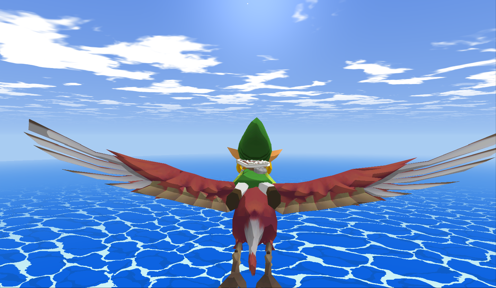

# Zelda Windward

A Wind Waker–style Zelda fan game. C++20, SDL3, raw OpenGL 3.3.



## Build

```powershell
cmake -S . -B build          # first run downloads SDL 3.4.14
cmake --build build --config Debug
.\build\Debug\zelda.exe
```

The `zelda` target reads `assets/` from disk and keeps the dev tooling
(clip viewer, screenshots, live tuning keys). For a release build — one
self-contained exe with every asset embedded and the debug tooling
compiled out — build `zelda_packed` instead:

```powershell
cmake --build build --config Release --target zelda_packed
.\build\Release\zelda_packed.exe
```

That exe runs anywhere on its own: no `assets/` folder, no tune files,
no debug keys, everything baked in.

## Assets

Includes copyrighted assets. The water shader derives from
[NekotoArts' CC0 work](https://www.shadertoy.com/view/3tKBDz).
Not affiliated with or endorsed by Nintendo.
